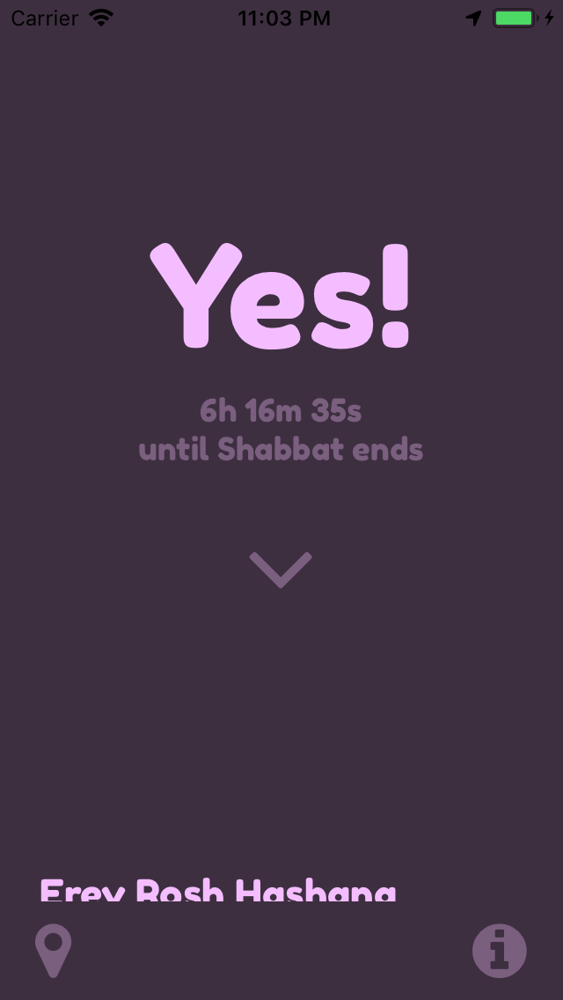
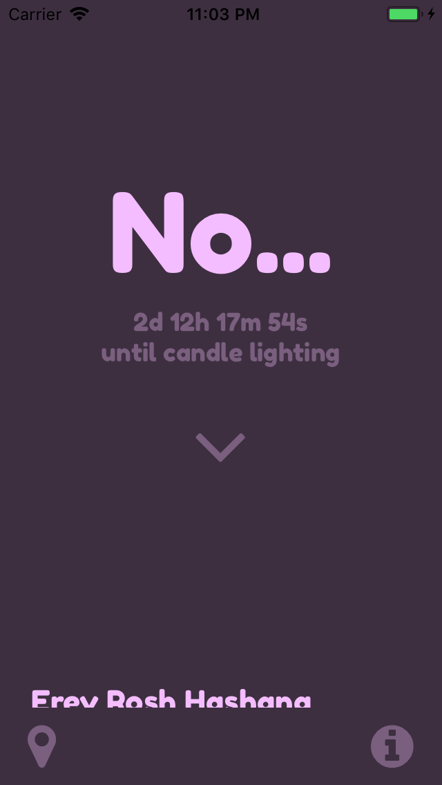
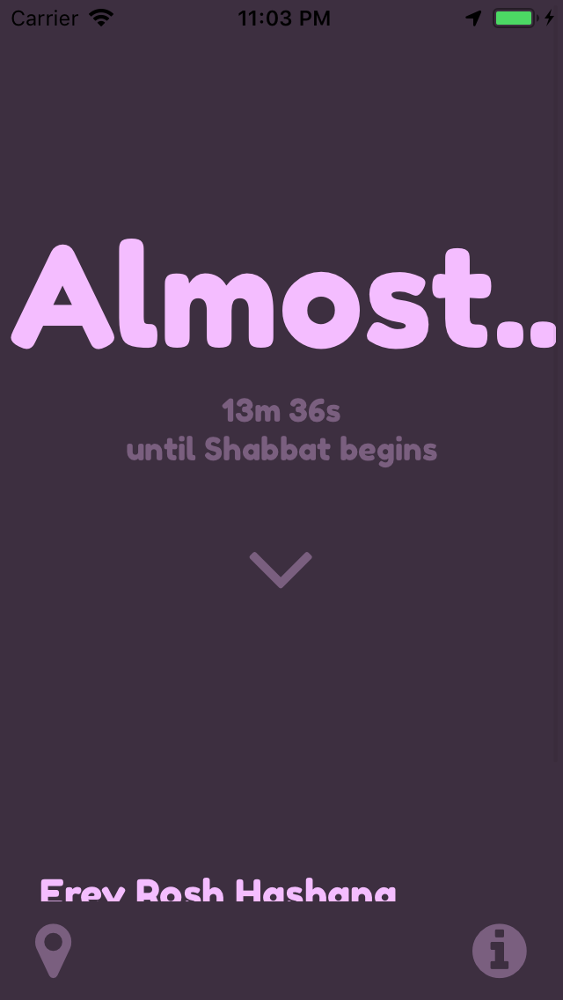
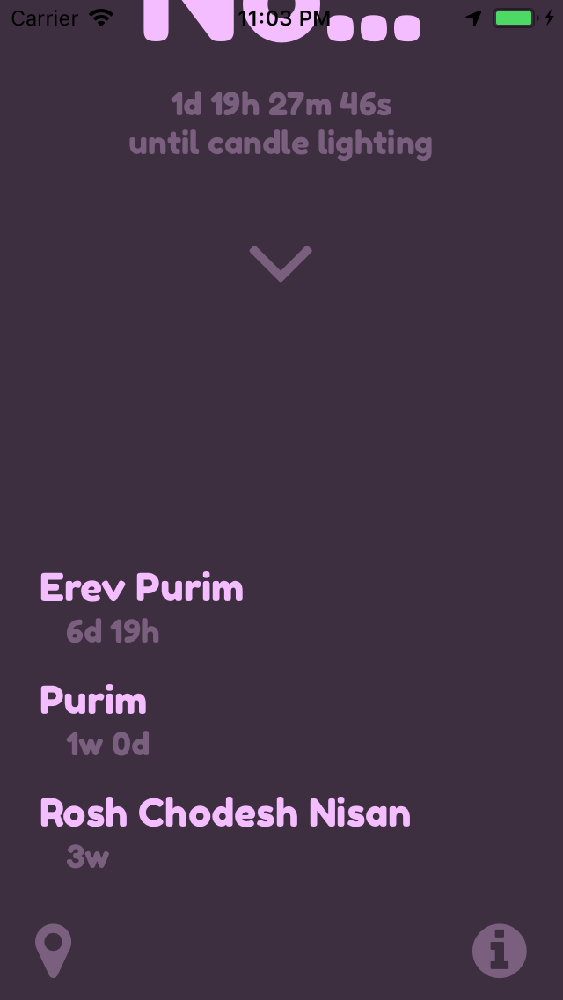

# Is It Shabbat?
"Is It Shabbat?" is a family of apps, libraries, and components aimed toward connecting everyone with God's holy days.

[Download the iOS App!](https://itunes.apple.com/us/app/is-it-shabbat/id1435157805)

- The Sabbath (roughly Friday sunset to Saturday sunset)
- Major holidays on the modern Hebrew calendar
- Rosh Chodeshim (first of each Hebrew month)

## iOS App Images

    
    
    
    
    

## Info
Uses [hebcal.com](https://www.hebcal.com/home/195/jewish-calendar-rest-api) APIs for holidays and Rosh Chodeshim.
