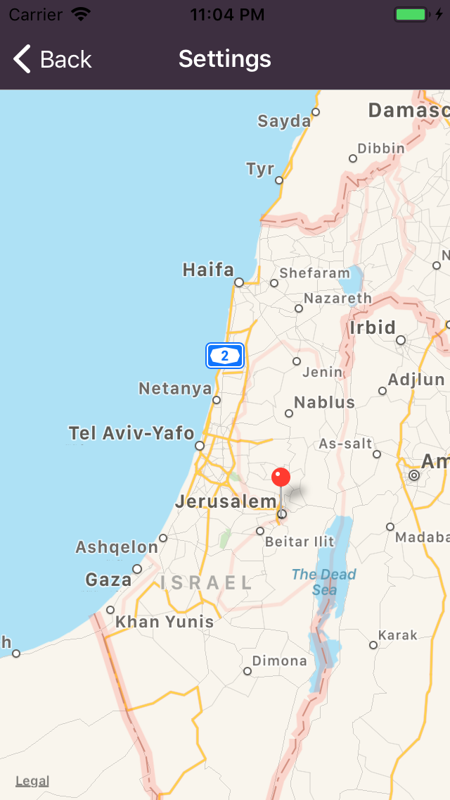

# Is It Shabbat?
"Is It Shabbat?" is a mobile app to connect you with God's holy days.

[Download the iOS App!](https://itunes.apple.com/us/app/is-it-shabbat/id1435157805)

- The Sabbath (roughly Friday sunset to Saturday sunset)
- Major holidays on the modern Hebrew calendar
- Rosh Chodeshim (first of each Hebrew month)

## iOS App Images

### Count down based on sunset at your selected location!

    
    
    

### Tap to see the time!

    
    
    

### See the times for your friends abroad!

    

## Information
Uses [hebcal.com](https://www.hebcal.com/home/195/jewish-calendar-rest-api) APIs for holidays and Rosh Chodeshim.
